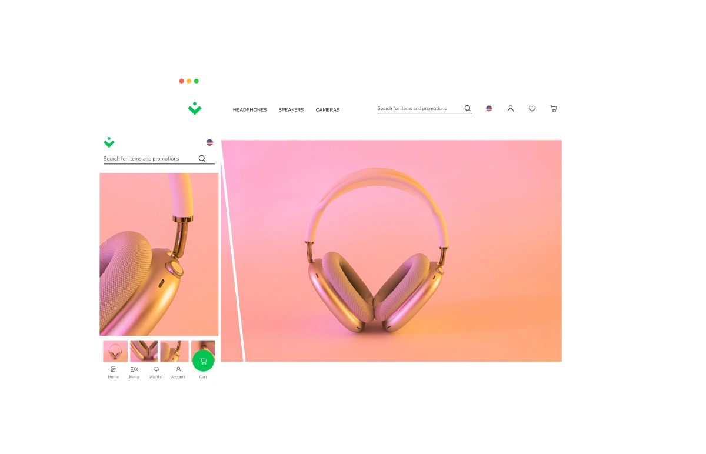

# Welcome!

Welcome to the Vue Storefront Docs Boilerplate! If you're creating a new Vue Storefront integration, this is the place to start. 

This Nuxt project can help you preview your content locally and get it ready to be merged into the Vue Storefront docs.

It extends our [Base Layer](https://docs.vuestorefront.io/community/contributing/docs/base-layer) to give you all of the modules, components, and features available in the deployed Vue Storefront docs.

Then, when you're ready to publish your content, we'll work with you to get add the `content` folder of this project as a remote Git source for the Vue Storefront docs.

::steps
#step-1
### Write
Add your content/assets inside of the `content` folder.

#step-2
### Integrate
Reach out to us on [Discord](https://discord.vuestorefront.io) to get your content connected to the docs.

#step-3
### Deploy

We'll work with you to pull your `content` folder into the docs and get your docs published!

::

## Useful Guides

::grid{:columns="3"}
#section-1
:card{to="https://docs.vuestorefront.io/community/contributing/docs/base-layer" title="Nuxt Content" description="Our Docs rely heavily on Nuxt Content features to create great learning experiences" icon="logos:nuxt-icon"}

#section-2
:card{to="https://docs.vuestorefront.io/community/contributing/docs/base-layer" title="Docs Base Layer" description="See all of the available components that you can use with our docs base theme." icon="ri:book-2-fill"}

#section-3
:card{to="https://docs.vuestorefront.io/community/contributing/docs/writing-guide" title="Writing Guide" description="Want help creating your content? Check out our docs writing guide to see some best practices on building great documentation." icon="ri:pencil-fill"}

::

## Tips

::warning
You can use the rest of this project to preview your content locally, but any components/layouts/composables/etc. will not be available to the published docs.

If you need additional functionality, reach out to us on [Discord](https://discord.vuestorefront.io) and we'll work with you to get it added to the docs base layer and make it available to all of our docs projects.

#title
:icon{name="ri:error-warning-fill" class="mr-2"}
Only your `content` folder will be pulled into the docs
::

### Place images directly in the `content` folder

If you need to use images in your content, you can place them directly in the `content` folder. Then, you can reference them in your content using the relative path.

